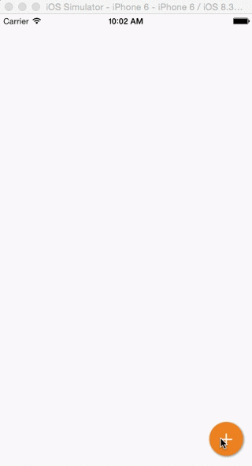

[](https://img.shields.io/cocoapods/v/ActionButton.svg)

Action button is a Floating Action Button inspired from Google Inbox implemented in Swift

Import
--
You can use [CocoaPods](https://cocoapods.org/) to integrate Action Button in your project.
You can install it with the following command

```
$ gem install cocoapods
```

Update your ```Podfile``` to use Action Button

```
pod 'ActionButton'
```
Then, run the following command

```
$ pod install
```
Requirements
--
- iOS 8.0+

Usage
--

#### Define your actions
```swift
let share = ActionButtonItem(title: "share", image: shareImage)
share.action = { item in println("Sharing...") }

let email = ActionButtonItem(title: "email", image: emailImage)
email.action = { item in println("Email...") }
```

#### Create a Action Button with your actions
```swift
actionButton = ActionButton(attachedToView: view, items: [share, email])
actionButton.action = { button in button.toggleMenu() }
```


Enjoy
--


## Give it a try
You can try Action Button with CocoaPods
```
$ pod try ActionButton
```
Who to blame
--
- [Lourenço Marinho](http://github.com/lourenco-marinho) ([@lopima](https://twitter.com/lopima))

More
--
Action Button is a working in progress so feel free to fork this project and improve it!

License
--
Action Button is released under the MIT license. See LICENSE for details.
